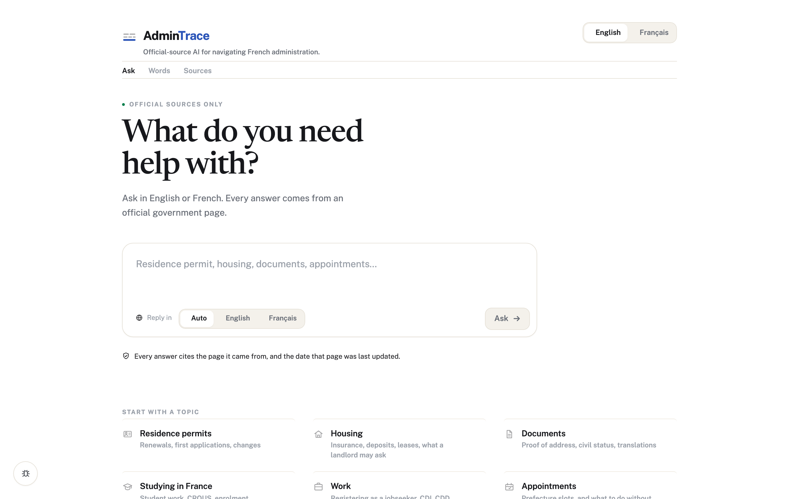
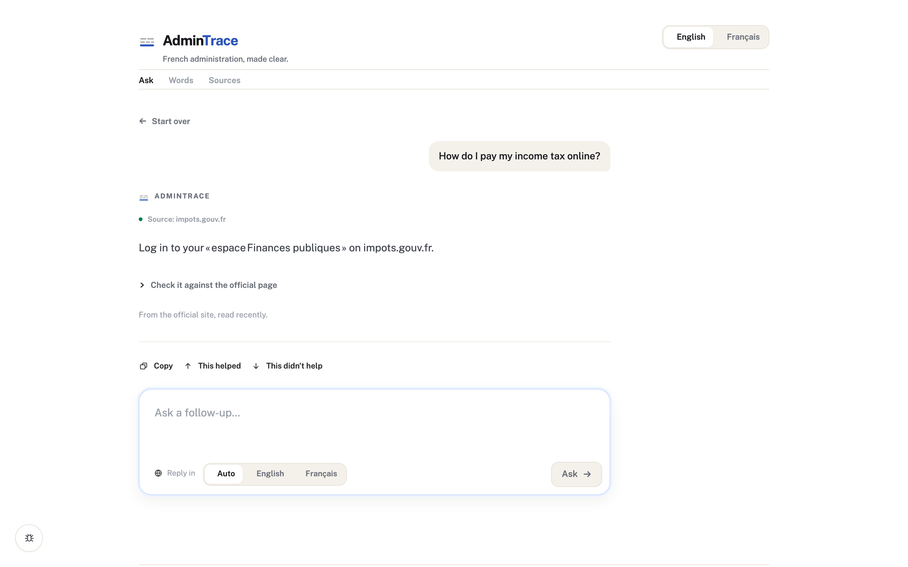
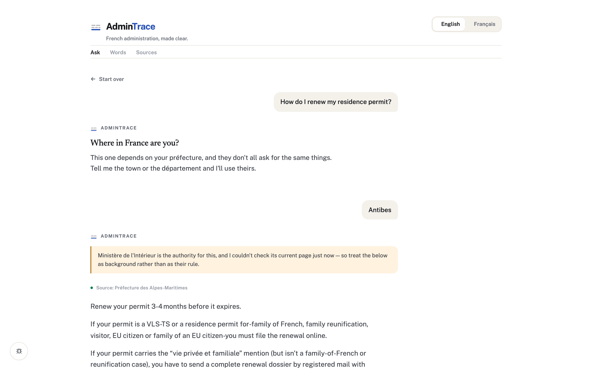
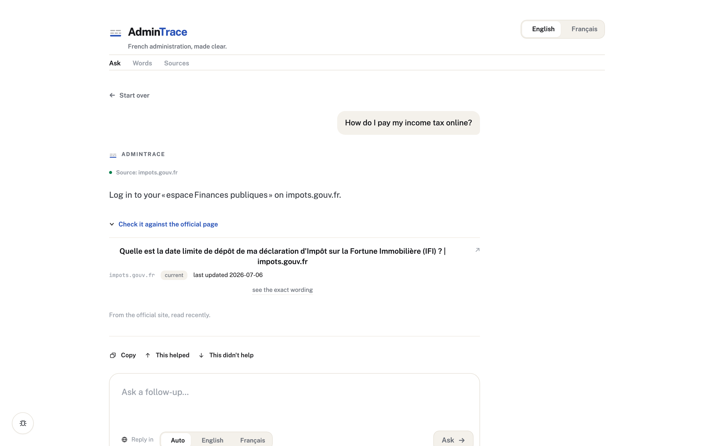
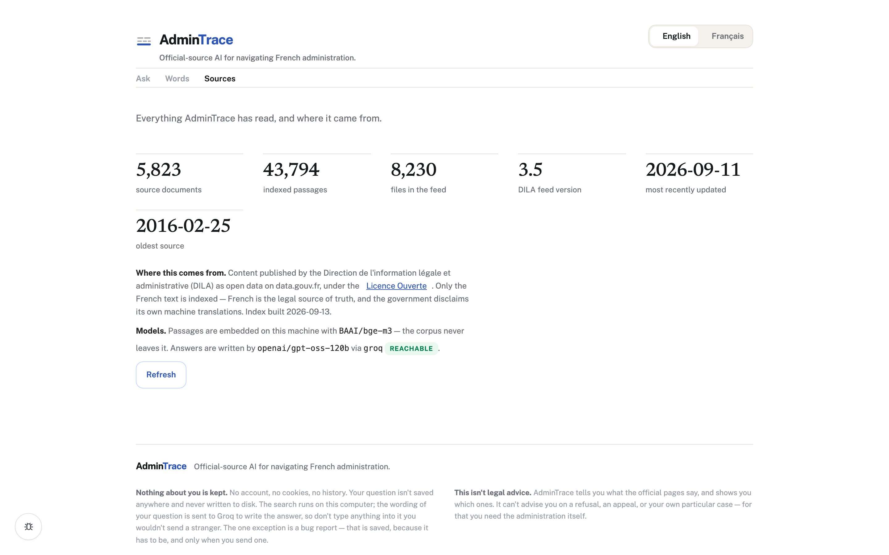

# AdminTrace

**Official-source AI for navigating French administration.**

AdminTrace answers questions about French administrative procedures from a
controlled set of official sources, and refuses to answer when the evidence is
insufficient. Ask in English or French; every answer cites the official page it
came from, with the date that page was last updated.

> **AdminTrace is an independent personal project and is not affiliated with any
> French administration.**

### Live Demo

**https://highly-lesser-protein-loved.trycloudflare.com**

Source: **https://github.com/Deepak420-GrandMaster/admintrace**

### Public Beta

AdminTrace is currently exposed as a temporary public beta through a Cloudflare
Quick Tunnel from the project owner's local machine. Availability depends on the
host machine being online.

Read that literally, because it is not hedging:

- the demo answers only while that Mac is awake, the app is running and
  `cloudflared` is running — any of the three stopping takes the link down;
- a Quick Tunnel is issued a **random hostname**, so restarting the tunnel
  produces a different URL and the address above stops resolving;
- it is one machine with no redundancy, no uptime target and no scaling — it is
  a demo of the real system, not production hosting;
- answers are written by a hosted model on a free tier, so a burst of traffic
  can exhaust the quota; the interface says so plainly instead of failing
  silently.

The GitHub repository is the permanent address. The tunnel URL is not.

## The problem

The information exists. It is spread across service-public.gouv.fr, ANEF,
préfecture sites, CAF, Ameli and a dozen others; it is written in legal French;
and what a general-purpose assistant tells you about it may be three years out
of date, or quietly invented, with no way to tell which.

Worse, the plausible answer and the correct one look identical. Ask how to
validate a long-stay visa and a model handed a préfecture's *renewal* page will
give you the renewal deadline. The page is official. The quote is accurate. The
answer is wrong, and nothing in it says so.

## Core principles

1. **The evidence decides what may be said.** The model writes the explanation;
   it does not supply the facts. Claims that the sources do not state are
   removed before a reader sees them.
2. **A closed list of official sources.** Nothing outside the registry is ever
   read or cited.
3. **Refusing is a valid answer.** "I could not verify this" beats a fluent guess
   about someone's visa.
4. **Say which authority, and where.** A national rule applied at a local counter
   is answered with both.
5. **No administrative fact lives in code.** Deadlines, fees and document lists
   reach a reader only from a retrieved page — enforced by a test.
6. **Everything that touches the corpus runs locally.**

## Screenshots

Captured from the running application.

| | |
|---|---|
|  |  |
| *The landing screen* | *An answer, with the official source it came from* |
|  |  |
| *Where you are decides which authority answers* | *What the answer rests on* |


*Everything indexed, and where it came from*

## Not legal advice

AdminTrace reports what official sources say and cites them. It cannot tell you
what to do about a refusal, an appeal, or your individual case. For that,
contact the administration concerned. The interface says so on every screen.

## Data source and attribution

The corpus is the open-data publication of **service-public.gouv.fr** by the
**Direction de l'information légale et administrative (DILA)**, distributed on
data.gouv.fr under the **Licence Ouverte / Open Licence**.

| | |
|---|---|
| Feed version | **3.5** (verified live; 3.3 is withdrawn, 3.4 is maintained in degraded mode) |
| Particuliers | [dataset](https://www.data.gouv.fr/datasets/fiches-pratiques-et-ressources-de-service-public-gouv-fr-particuliers) · 5,584 files |
| Entreprendre | [dataset](https://www.data.gouv.fr/datasets/fiches-pratiques-et-ressources-entreprendre-service-public-gouv-fr) · 2,646 files |
| Indexed | 5,823 distinct documents → 43,794 passages |

The Licence Ouverte requires stating the source and the date the information
was last updated. AdminTrace does that on every citation. It is also how a reader
decides whether to trust what they just read, so it is never stripped.

Only the French source text is ingested. French is the legal source of truth,
and the machine-translated versions are disclaimed by the government that
publishes them.

DILA also publishes a pre-chunked, pre-vectorised version of the same fiches.
It is deliberately not used here; it is a useful benchmark to compare our own
retrieval against later.

## Setup

Requires [uv](https://docs.astral.sh/uv/) and Python 3.12.

```bash
git clone <this repository> admintrace && cd admintrace
cp .env.example .env                    # then set GROQ_API_KEY — never commit .env
uv sync --extra dev --extra render      # render: Playwright, for JS-built official sites
uv run playwright install chromium
scripts/install_git_hooks.sh            # guards pushes against secrets and force

uv run python -m app.ingest.pipeline    # download and index the corpus (large; once)
uv run python -m app.sync_sources --all # read the official sites once
uv run python -m app.ui.app
```

Then open **http://localhost:7860**.

The source sync matters on a fresh clone. A registered official site is only
queried live once a version of it has been stored, so until the first sync
every live question is — correctly — refused rather than answered from nothing.

Configuration lives in `.env`, read only by `app/config.py`. `.env.example`
lists every variable with no secrets in it. In CI, the same names come from
GitHub Actions secrets; in production, from the deployment's secret manager.
Never mix the three.

## Running it for real

AdminTrace answers from two kinds of evidence: the local corpus, and a closed list
of official sites read over the web. The second needs looking after, and these
are the commands that do it. Full detail in [docs/SOURCES.md](docs/SOURCES.md).

```bash
# What is proven, what is only tested, and what is blocked.
uv run python -m app.production_report          # add --write for the JSON scorecard

# Are the registered sources reachable, and do they still parse?
uv run python -m app.live_source_check          # --write records health
uv run python -m app.source_report              # per-source detail
uv run python -m app.coverage_report            # per-topic coverage

# Re-read what is overdue, version it, invalidate what it changed.
uv run python -m app.sync_sources --dry-run
uv run python -m app.sync_sources --all --due

# Is it well? Reads only; safe from cron. Non-zero when a person is needed.
uv run python -m app.healthcheck                # --write saves a snapshot

# How fast, and what the model provider is costing. Derived from recorded
# timings — an empty report means nothing has been measured, not that all is well.
uv run python -m app.performance_report         # --by provider, --json

# What still needs a person to look at it.
uv run python -m app.review_queue

# Keep the archive inside its retention policy.
uv run python -m app.prune_history --dry-run

# Bug-report mail.
uv run python -m app.test_email --check-config
uv run python -m app.test_email --dry-run
uv run python -m app.test_email --send
```

Sources that render in the browser (ANEF, France Titres, France Travail, the
Préfecture de police) need the optional extra:

```bash
uv sync --extra render
uv run playwright install chromium
```

### One command before you ship

```bash
uv run python -m app.verify           # --quick skips the browser layer
```

It runs the layers in the order that fails cheapest first — configuration,
offline suite, network suite when enabled, security, sources, browser smoke,
SMTP, scorecard — and prints one of `PASSED`, `FAILED`, `SKIPPED`,
`NOT CONFIGURED` or `BLOCKED` for each. Those last three are deliberately not
interchangeable: a suite nobody ran, a capability nobody configured, and a
site that refuses us are three different facts.

The exit code is a deployment gate rather than a summary of the output, and it
asks a narrower question than "is everything green": *is anything we are
responsible for broken?*

| | |
|---|---|
| **Critical** — blocks a deploy | configuration, the offline suite (core backend, security, answer validation, entity and jurisdiction resolution, localization), the security checks, browser smoke |
| **Non-critical** — reported, never hidden, never blocking | an individual external source unavailable or blocked, SMTP not configured, history not yet deep enough, a real-world change not yet observed, the network suite |

CAF being behind a bot wall does not stop AdminTrace shipping. The system is built
to say so at answer time, and the tests prove it does. A failing security
check or a broken interface does stop it.

### Tests

Tests that leave the machine are opt-in, so the default suite stays offline,
fast, and immune to somebody else's outage:

```bash
uv run pytest                                           # offline
ADMINTRACE_NETWORK_TESTS=1 uv run pytest                # and the live web

# Browser tests start the app themselves. Nothing to set up first.
uv run python -m app.browser_tests --smoke              # ~15s, every deploy
uv run python -m app.browser_tests                      # ~55s, every merge
ADMINTRACE_BROWSER_TESTS=1 uv run pytest tests/browser  # same, via pytest
```

The smoke suite is the one worth running on every deploy: if it passes, the
interface loads, speaks both languages, takes a question and shows an answer
with a source. The full matrix sweeps seven viewports, both sections,
keyboard navigation and outbound network, and is better suited to a merge or
a nightly run. Console errors fail whichever test produced them — a page can
look perfect in a screenshot while its JavaScript has thrown, and every
interaction after that silently does nothing.

The suite starts the real entrypoint (`app.ui.app`) on a free port, polls until
it answers, and stops it afterwards — including when a test fails. There is no
second server implementation to drift from production. Useful knobs:

| Variable | Default | |
|---|---|---|
| `ADMINTRACE_TEST_PORT` | a free port | pin the port instead of allocating one |
| `APP_START_TIMEOUT_SECONDS` | `60` | how long to wait for the app to answer |
| `ADMINTRACE_BROWSER_URL` | unset | use a server you started yourself; the suite starts nothing |
| `ADMINTRACE_BROWSER_TRACE` | off (on under `CI`) | record a Playwright trace for failures |

When a browser test fails it writes a screenshot, the page HTML, the console,
the failed requests, the app's own log and (with tracing on) a Playwright
trace to `artifacts/browser/`, and prints the URL and that log to the terminal.
The directory is gitignored: it is test output, never source.

All three suites can run in one pass — `ADMINTRACE_NETWORK_TESTS=1
ADMINTRACE_BROWSER_TESTS=1 uv run pytest`. Rendering does its browser work on a
thread of its own precisely so that it can: Playwright's sync API refuses to
start a second session on a thread that already holds one, which is also what
would happen to a render called from inside the asyncio loop AdminTrace serves on.

### What to run, and how often

One scheduler, already here: `scripts/refresh-sources.sh` for anything on a
timer. Nothing below needs a second task system.

| Cadence | Command | Why |
|---|---|---|
| Every 6h | `scripts/refresh-sources.sh` | re-read due sources, version changes, exit non-zero when something needs review |
| Daily | `app.healthcheck --write` | a snapshot, so a trend is visible before a symptom is |
| Daily | `app.review_queue` | what is waiting on a person |
| Weekly | `app.prune_history` | keep the archive inside its retention policy |
| Weekly | `app.performance_report` | latency p95 against target, and how often the provider refused |
| Every deploy | `app.verify` | the gate above, browser smoke included |
| Every merge | `app.browser_tests` | the full interface matrix |

`app.healthcheck` and `app.review_queue` read only and are safe from cron. An
empty review queue is a success, not an error.

### Working on AdminTrace: GitHub is the canonical history

A finished change is tested, scanned, committed and pushed — in that order,
by one command that stops at the first problem:

```bash
scripts/ship.sh "fix: preserve the task through clarification" app/query/conversation.py tests/test_conversation_state.py
```

It stages only the paths named, so unrelated work stays where it is; refuses
on whitespace errors, conflict markers, a detected secret, a vague message or
failing tests; fetches, and refuses to push if local and remote have diverged;
and never force-pushes. Its exit code says what happened — pushed, refused
before committing, or committed locally but not pushed — and it prints the
commit, branch and push result. Claude Code follows the same procedure, set
out in `CLAUDE.md`.

```bash
uv run python -m app.github_status --fetch   # branch, local vs remote, ahead/behind, clean/dirty
python3 scripts/secret_scan.py --history     # locations of any finding, never values
```

`scripts/install_git_hooks.sh` installs a pre-push hook that refuses any push
rewriting remote history and any push containing a detected secret.
`--auto-push` adds a post-commit push as well; it is off by default because
a hook cannot run the tests first.

**What is and is not in the repository.** Source code, tests and fixtures,
the source/jurisdiction/procedure registries under `app/`, templates, docs,
scripts and workflows are versioned. Everything under `data/` is runtime
state and never is: the corpus and embeddings, fetched source versions and
the audit log, the derived production scorecard, and — most importantly —
real user bug reports. Test fixtures are synthetic or public source text.

**Continuous integration** (`.github/workflows/`):

| Workflow | When | What |
|---|---|---|
| `ci.yml` | every push and PR | offline tests, `app.verify --quick`, browser suite (self-starting app) |
| `security.yml` | push, PR, weekly | secret scan of tree and full history (two scanners), dependency advisories, security tests |
| `network-tests.yml` | daily, on demand | source sync then live-web tests; model-backed browser answer tests if a `GROQ_API_KEY` secret exists |
| `refresh-sources.yml` | every 6 hours | source health and sync; versions persist between runs in the Actions cache, never in commits |

CI has no model key and no built corpus, and says so: tests that need an
answer or the corpus are reported as *NOT CONFIGURED* rather than failed or
silently passed. Add `GROQ_API_KEY` under *Settings → Secrets and variables →
Actions* to run answer tests; it is never written into a workflow file.

### What "production ready" means here

`app.production_report` distinguishes a capability that works from one that has
met real data. A passing test earns `mechanism_verified`; only a real-world
observation earns `production_verified`. The scorecard is derived from what is
on disk and is never hand-edited — a readiness file somebody can type into is a
readiness file that will eventually be wrong.

### Backup

Everything that matters lives under `data/` and is plain JSON:

| Path | What it is |
|---|---|
| `data/sources/versions/` | every version of every official page |
| `data/sources/claims/` | what each version asserts, with provenance |
| `data/sources/index.json` | which version is currently answering |
| `data/sources/audit.jsonl` | every decision this layer made |
| `data/sources/incidents.json` | source failures and recoveries |
| `data/review/` | changes and conflicts awaiting a person |
| `data/bugs/` | bug reports, by status |
| `data/chroma/` | the embedded corpus (rebuildable from the feed) |

Copying `data/` is the backup. Restoring it is the recovery; `data/chroma/`
can be rebuilt from scratch with `uv run python -m app.ingest.pipeline` if it
is lost, at the cost of a re-embed.

The first ingestion downloads ~33 MB, parses it, and embeds 43,794 passages
locally. Embedding is the slow part — a few hours on an Apple GPU. It is
resumable: interrupt it and run the same command again.

### Models

| Job | Runs | Why |
|---|---|---|
| Embedding | locally, `BAAI/bge-m3` | Multilingual by requirement, not preference: the corpus is French and half the questions are English. An English-first model fails on exactly the vocabulary that matters. The corpus never leaves the machine. |
| Answering, translation, answerability | `LLM_PROVIDER` — `groq` or `ollama` | Interchangeable. Nothing outside `app/llm/` knows which is in use. |

Set `LLM_PROVIDER=ollama` with `OLLAMA_CHAT_MODEL` to run with no hosted API at
all. With `groq`, questions are sent to Groq; the corpus is not.

## How it works

```
question
  ├─ detect language ─────────────── hand-written EN/FR discrimination
  ├─ resolve context ─────────────── entity, place, pending clarification
  ├─ if English: translate to a French search query
  ├─ glossary expansion ──────────── adds the French term a document actually uses
  ├─ route ───────────────────────── which authority owns this topic, and where
  │    ├─ live official sources ──── registry allowlist only
  │    └─ corpus ─────────────────── dense (bge-m3) + BM25, reciprocal rank fusion
  ├─ select ──────────────────────── material relevance: entity, place, purpose
  ├─ evidence gate ───────────────── deterministic; refuses without a model call
  ├─ answer ──────────────────────── one model call, shown only the cited evidence
  ├─ claim validation ────────────── every sentence checked against the evidence
  └─ answer in the asker's language, or refuse
```

The stages are deliberately distinct, and each can refuse on its own:

| Stage | What it decides |
|---|---|
| **Retrieval** | which passages of the local corpus are topically close |
| **Live official-source access** | which registered official pages to read now, and whether they may be cited at all |
| **Jurisdiction routing** | which authority owns the topic where the reader is |
| **Answer generation** | how to say it — one model call, shown only the evidence that will be cited |
| **Claim validation** | whether each sentence is actually supported by that evidence |
| **Refusal** | what to say when any of the above leaves nothing |

### Official-source policy

AdminTrace reads **17 registered official websites** (`app/sources/registry.yml`)
and nothing else. A source is listed only after it has been fetched, parsed and
verified, and it is promoted to live querying only once a version of it has been
stored — so a fresh install refuses local questions rather than answering from
an unread page. Requests are https-only, respect robots, cap size and type, and
validate every redirect hop: a site that redirects us off its own domain is
refused, not followed. A source behind a bot wall is recorded as blocked and
never bypassed.

### Jurisdiction routing

French immigration procedure is national law applied at a local counter, so
"which préfecture" changes the answer. AdminTrace knows all 101 départements as
geography, and resolves a reader's town to one of them. A département names a
source only when that préfecture's own pages have been verified; otherwise the
reader is told which préfecture decides and that its page is not among the
registered sources. Being the local authority is not being the authority on
every subject: a transport question is not routed to an immigration préfecture.

### Claim-level verification

After the answer is written, each of its sentences is checked against the
evidence it came from — with no further model call. Figures are compared
exactly: durations in digits or words, English or French, ranges included;
amounts; dates; scores; and whether a deadline counts from expiry or from
arrival. Named portals and authorities must appear in the evidence, not be
inferred from a government domain. Each claim is tied to the procedure it
belongs to, so a renewal deadline cannot be presented as a validation deadline.

Similarity is used only to confirm two sentences share a subject, never to
decide that a requirement is supported: measured on this corpus, a faithful
English paraphrase of a French page and a plausible invention score in the same
band. Unsupported and contradicted claims are removed; an invented link is
stripped and the sentence around it kept. If nothing survives, one repair is
attempted from compatible evidence only, and failing that the reader is told the
answer could not be verified. An empty answer is never rendered as one.

### Refusal behaviour

Refusals are distinguished, because they mean different things to the reader:

- **source gap** — the authority publishes nothing that answers this;
- **authority unavailable** — the body that decides is known but could not be
  read (CAF, behind a bot wall);
- **needs clarification** — the answer genuinely differs by place, institution
  or status, and one question is asked instead of averaging;
- **could not verify** — something was written, and the evidence did not
  support it.

No refusal offers "closest pages we found". A page that failed the relevance
gate is not a lead; it is a page about another subject.

### Bilingual

English and French throughout — interface, answers, glossary and refusals.
French administrative vocabulary is kept in the answer, because that is the word
the counter will use. Retrieval always runs against the French text: French is
the legal source of truth and the government disclaims its own machine
translations.

### Freshness and unavailability

Every citation carries the date the page itself stated, and a badge saying
whether it was read live, served from a recent copy, or is stale. Sources are
re-read on a schedule; a substantive change invalidates what it touched and is
queued for review. A source that cannot be read is reported as unreachable
rather than silently dropped, and its absence is visible in
`app.source_report` and `app.production_report`.

### Why the gate has two stages

Similarity alone cannot decide whether to refuse. Measured against this
corpus, the question the sources genuinely do not answer (`gen-010`, "there are
no appointment slots at my préfecture") scores **higher** than the weakest
question they do answer:

```
answerable questions : min 0.542   median 0.660   max 0.772
gen-010, must refuse : 0.561 (en)  0.588 (fr)
```

No threshold separates them, because the corpus really does contain passages
about booking préfecture appointments. They are topically close; they simply do
not answer the question asked. Cosine similarity measures topical closeness,
not answerability, so a second stage asks that question directly. It can only
ever remove an answer, never add one.

That second stage is the evidence gate, and it no longer starts at the model.
Retrieval that is decisive either way — strong agreement across several
documents, or nothing above the floor — is settled arithmetically, and the
model is asked only when the scores are genuinely ambiguous. The thresholds
come from the measured distribution above, not from taste.

### Why applicability is preserved

Many fiches are *conditioned*: their body splits into mutually exclusive
branches — `ListeSituations`/`Situation` and `BlocCas`/`Cas` — such as "first
year" versus "after one year of residence", which carry different document
lists and different fees. 1,085 documents branch this way, across 1,521
distinct branch labels.

Flattening them would let the rules for one situation be read as the rules for
another. Every chunk therefore belongs to exactly one branch and carries its
label, and no chunk mixes two.

### What retrieval still misses

A fiche answers a question across its sections: the amount in one, the refund
in another. Evidence selection therefore keeps distinct *sections* of a page —
up to three of them — rather than treating the page as a single candidate,
which used to discard every section but the first.

That is not the whole problem. A compound question — "how much deposit can a
landlord ask for, **and when do I get it back**" — becomes one search query in
which the second half dominates, and the passage carrying the amount never
enters the results. The answer then covers the half that was retrieved and says
plainly that the sources it has do not state the other. The gate is behaving
correctly on the evidence it was given; the evidence is what is wrong, and
fixing it means multi-query retrieval rather than a threshold change. Until
then, one question at a time retrieves better than two.

A second limit is routing, not retrieval. When a topic has a registered live
authority, the question goes there — so a question about employment contract
law is put to France Travail, whose pages are about its own services, and is
refused even though the corpus answers it. Asking the library directly answers
it; asking through the interface does not. The refusal is honest, and the
routing is defensible — France Travail *is* the authority for work — but the
reader loses an answer the system holds. Falling back to the corpus when the
authority's own pages do not cover the question is the obvious fix and is not
in this release.

## No administrative fact lives in code

Deadlines, fees, hour limits, document lists and eligibility conditions reach a
user only from a retrieved document. `tests/test_no_hardcoded_facts.py`
enforces this mechanically, failing if a monetary amount or a French duration
appears anywhere in `app/` or `eval/`.

## Evaluation

```bash
uv run python eval/run_eval.py
```

The gold set is 51 questions, each phrased in both English and French, across
student, worker, freelance, family and general segments. Results are written
to `eval/results/`.

The headline metric is **cross-lingual agreement**: how often the English and
French phrasings of the same question reach the same sources. It is the measure
of whether the central claim holds.

`expected_fiche_id` is deliberately empty. A guessed gold label is worse than
no gold label, so retrieval hit rate is reported as unmeasurable until those
are filled in by hand.

### Current results

Run on the 51-question set, both languages, against feed 3.5:

| | |
|---|---|
| Cross-lingual agreement (same top-3, any order) | **11.8%** (6/51) |
| Same top-3, same order | 2.0% (1/51) |
| Same top-1 source | 54.9% (28/51) |
| Mean overlap of top-3 | 42.0% |
| Distinct source documents per answer | 4.75 of 6 slots |

**Cross-lingual agreement is the weakest part of the system and is not yet good
enough.** The top source agrees more than half the time, and on average the two
phrasings share about two of three sources — but strict top-3 agreement is low.
The likely causes, in order of suspicion: the English question is translated
before retrieval, so the two paths search with genuinely different wording;
reciprocal rank fusion produces many near-ties among passages of similar
relevance, which reorder easily; and this corpus contains many near-duplicate
passages across fiches, so several defensible orderings exist.

Retrieval hit rate is not measurable until `expected_fiche_id` is filled in.

### Refusal

`gen-010` — "there are no appointment slots at my préfecture" — is the
designed refusal case. The similarity gate cannot catch it, for the reason
above. The answerability stage does catch it, with the right reasoning:

> NO. The passages only state that you must make an appointment and check the
> prefecture website; they do not explain what to do when no slots are
> available.

**But it does not catch it every time.** The check has been observed refusing
the question in one run and answering it in the next, with a fixed seed and
zero temperature. A gate that is right most of the time is not yet a gate, and
this is the most important open issue in the project.

`stu-002` — "what happens if I missed the three-month deadline" — is refused in
both languages. That is plausibly *correct*: the corpus documents the deadline,
not the consequences of missing it. The gold set assumes it is answerable, which
may be the gold set's error rather than the system's.

### Rate limits

The answerability check used to send the passages to the model a second time,
so every question cost two calls. On Groq's free tier — 8,000 tokens per minute,
against which a requested `max_tokens` is *reserved*, not merely counted — two
calls were enough to hit a 429 on consecutive questions.

The evidence gate now decides the same thing from retrieval scores, and reaches
the model only when those scores are ambiguous, so the common path is one call
rather than two. That is a property of the code, which you can read; it is not
a latency promise, and this README deliberately quotes no median response time.
Speed depends on the provider, the plan, the question and the machine.

The limit has not gone away either. Asked back to back by a script, answers
here are still rate-limited a noticeable fraction of the time on the free tier
— a person reading each reply before asking the next hits it far less. When the
provider does refuse, the reported interval is waited out and retried twice, up
to 35 seconds; a longer wait fails immediately and the interface says the
provider is rate-limited, rather than spending two minutes to produce nothing.

Run `app.performance_report` to see what your own installation does: calls per
answer, latency by response class, how often the provider refused, and what
claim validation cost. Those numbers live in `data/`, which is runtime state
and is never committed, so nothing here can be taken on trust from the
repository — measure it yourself.

## Known gaps

These are properties of the official corpus, not bugs:

- **Département-level practice** — which documents a particular préfecture
  actually asks for. Mostly absent, and it varies enormously. (Partially
  present in places: one fiche carries a branch per département.)
- **Appointment availability** — the single biggest real-world blocker, and
  the thing `gen-010` asks about. No official source answers it.
- **Actual processing times** versus published targets.
- **Which banks accept which documents** for opening an account.
- **Whether a given landlord or agency accepts Visale** in practice.

These need crowdsourced data rather than an official corpus.

Not in the corpus and not in the registry, so nothing is answered from them:
urssaf.fr and visale.fr.

ANEF, Campus France, CROUS, ameli.fr, impots.gouv.fr, ANTS/France Titres and
six local authorities (five préfectures and the Paris police prefecture) are
*registered* rather than ingested: they are read live from their own sites, not
downloaded into the index. caf.fr is registered but its bot protection refuses
automated reads, so it is recorded as blocked and never queried — the scorecard
shows it as blocked rather than as working.

The public directory of ~75,000 administrations is fetched and cached but
deliberately not wired into answers yet. Until it is, a refusal that names an
administration is drawing on the model's own knowledge rather than on data —
which is why refusals here point only to pages actually retrieved.

## Layout

```
app/
  config.py        every setting, read nowhere else
  ingest/          fetch → parse → chunk → embed
  retrieval/       dense, keyword, fusion, gate
  query/           language detection, translation, glossary
  answer/          prompts, generation, citations
  llm/             chat providers (groq, ollama)
  ui/              Gradio app, stylesheet, HTML rendering
  directory/       administration lookup (cached, not wired in)
eval/              gold set and metrics runner
tools/             glossary builder
```

## Licence and attribution

**Source data** © DILA, published under the
[Licence Ouverte / Open Licence](https://www.etalab.gouv.fr/licence-ouverte-open-licence).
Institution records come from the ONISEP open-data register.

**This code** is released under the [MIT licence](LICENSE) — use it, change it,
ship it, with the copyright notice kept. The licence covers the code in this
repository and nothing else: the corpus is DILA's and carries its own terms,
and the official pages read live belong to the administrations that publish
them.

**AdminTrace is an independent personal project and is not affiliated with any
French administration.** It is not endorsed by or operated by any government
body, and it is not legal advice.
